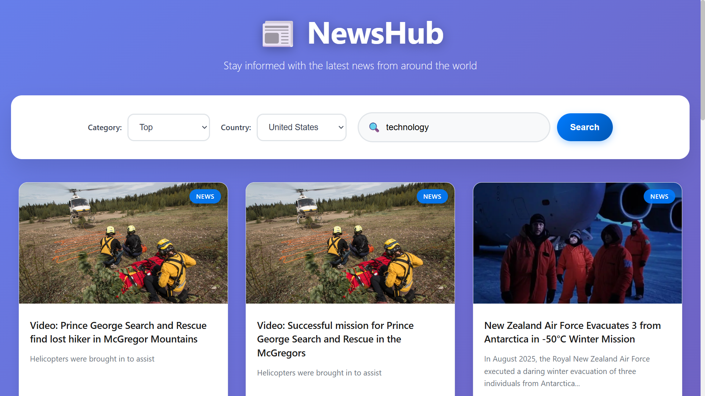
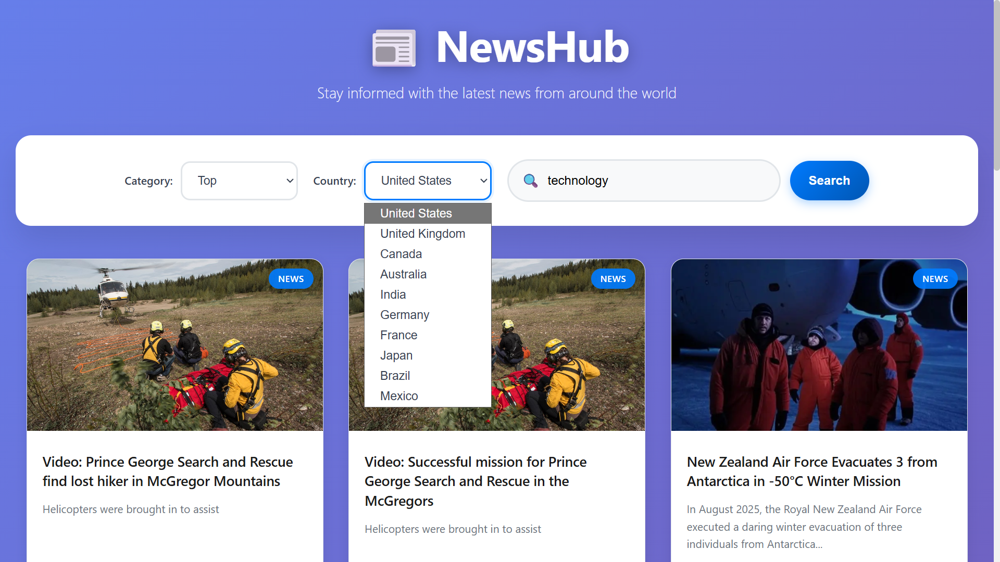
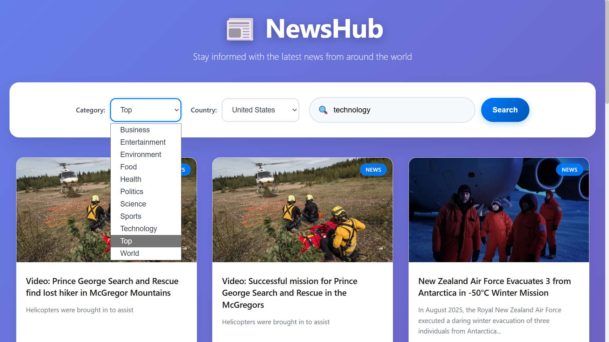

# News App

A modern React-based news application that fetches and displays the latest news articles from various sources.

## Screenshots

### Main Interface

*Main dashboard showing news articles with search and filter options*

### Country Filtering

*Filtering news by different countries*

### Category Filtering

*Filtering news by different categories*


## Features

- 📰 Latest news articles from multiple sources
- 🔍 Search functionality for specific topics
- 📂 Filter by categories (General, Business, Entertainment, Health, Science, Sports, Technology)
- 🌍 Filter by country (US, UK, Canada, Australia, India)
- 📱 Responsive design with hover effects
- 🖼️ Image support for articles
- 🔗 Click to read full articles

## Setup Instructions

### 1. Get a News API Key

1. Visit [NewsAPI.org](https://newsapi.org/)
2. Sign up for a free account
3. Get your API key from the dashboard

### 2. Update the API Key

Open `src/App.jsx` and replace `YOUR_NEWS_API_KEY` with your actual API key:

```javascript
const apiKey = 'your-actual-api-key-here';
```

### 3. Install Dependencies

```bash
npm install
```

### 4. Run the Application

```bash
npm run dev
```

The app will open at `http://localhost:5173`

## Usage

- **Search**: Enter keywords in the search box and click "Search"
- **Categories**: Select from dropdown to filter by news category
- **Countries**: Select from dropdown to get news from specific countries
- **Read Articles**: Click on any news card to open the full article

## API Information

This app uses the [NewsAPI](https://newsapi.org/) service:
- Free tier: 100 requests per day
- Paid tiers available for higher usage
- Covers news sources from around the world

## Technologies Used

- React 19
- Vite (build tool)
- Axios (HTTP client)
- NewsAPI (news data source)

## Demo Mode

If you don't have an API key yet, the app will show demo articles with placeholder content.

## Features to Add

- Save favorite articles
- Dark/light theme toggle
- Pagination for more articles
- Social sharing
- Offline reading
